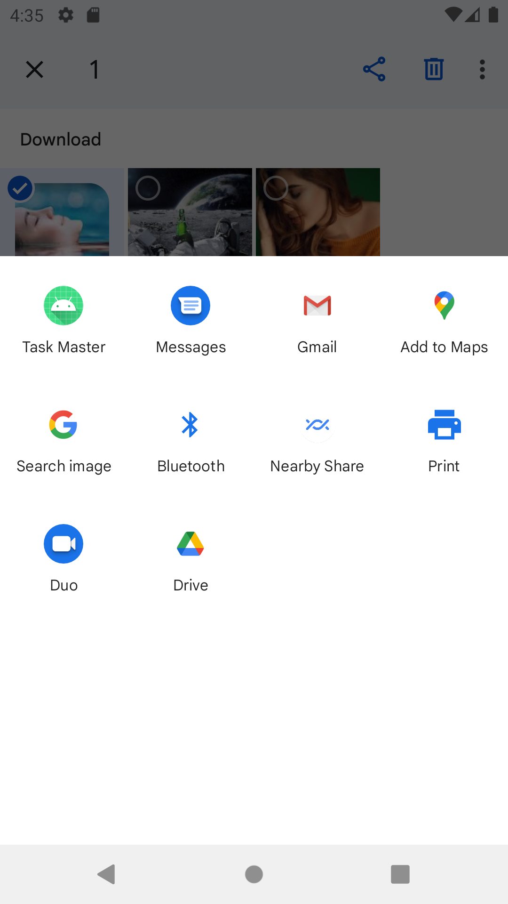

# taskmaster
this app use for create task and view the task in main activity .

## daily change log 
### lab 26:
1- create main activity and add task activity and all task activity .

2- create on click on click listener for add task button.

--------------------------------------------
# Main Activity

## daily change log 
### lab 27:
1- create task details page with description 
lorem .

2- create setting page to make user save username .

3- refactor how page and add 3 button .

# Main Activity

# Task Activity

#  Task Activity

#  Task Activity

#  Add Task Activity

#  All task  Activity

#  Setting  Activity

------------------------

## daily change log
### lab 28:
1- create task class .

2- refactor main activity and add recyclerView
# Main Activity

# Task Activity

#  Task Activity

#  Task Activity

#  Add Task Activity

#  All task  Activity

#  Setting  Activity

----------------------
## daily change log
### lab 29:
1- implement Room Database
2- make recycler view render element form database.
3- implement delete and update for task 

# Main Activity

# Task Activity

#  Task Activity

#  Task Activity

#  Add Task Activity

#  All task  Activity

#  Setting  Activity

----------------------------------------------------------------
## daily change log
### lab 30:
add more Espresso UI tests

# Main Activity

# Task Activity

#  Task Activity

#  Task Activity

#  Add Task Activity

#  All task  Activity

#  Setting  Activity

## daily change log
### lab 31:
add more Espresso UI tests

# Main Activity

# Task Activity

#  Task Activity

#  Task Activity

#  Add Task Activity

#  All task  Activity

#  Setting  Activity

## daily change log
### lab 32:
connect own app on aws and use the amplify api instead for Room database 

# Main Activity

# Task Activity

#  Task Activity

#  Task Activity

#  Add Task Activity

#  All task  Activity

#  Setting  Activity

## daily change log
### lab 33:
create the team entity and , make the user to choose his team 
and after that show only task about this team 

# Main Activity

# Task Activity

#  Task Activity

#  Task Activity

#  Add Task Activity

#  All task  Activity

#  Setting  Activity

## daily change log
### lab 34:
Build apk for app 

# Main Activity

# Task Activity

#  Task Activity

#  Task Activity

#  Add Task Activity

#  All task  Activity

#  Setting  Activity

## daily change log
### lab 36:

1- create Login page and make user Login .
2- create SignUp page and make the user SignUp.
3- make the user logout .

4- display username in main activity .

# Main Activity

# Task Activity

#  Task Activity

#  Task Activity

#  Add Task Activity

#  All task  Activity

#  Setting  Activity

# login activity

# SignUp activity

## daily change log
### lab 37:

1- make user upload the image in add task activity.
2- display the image in task details activity.

# Main Activity

#  Task Activity

#  Task details Activity

#  Add Task Activity

#  All task  Activity

#  Setting  Activity

# login activity

# SignUp activity

## daily change log
### lab 38:

make the user share  image  from another application to my application 

# Main Activity

#  Task Activity

#  Task details Activity

#  Add Task Activity

#  All task  Activity

#  Setting  Activity

# login activity

# SignUp activity

# Share intent Activity 

## daily change log
### lab 39:

location retrieved and included as part of the saved Task.

# Main Activity

#  Task Activity

#  Task details Activity

#  Add Task Activity

#  All task  Activity

#  Setting  Activity

# login activity

# SignUp activity

# Share intent Activity

# Map activity

